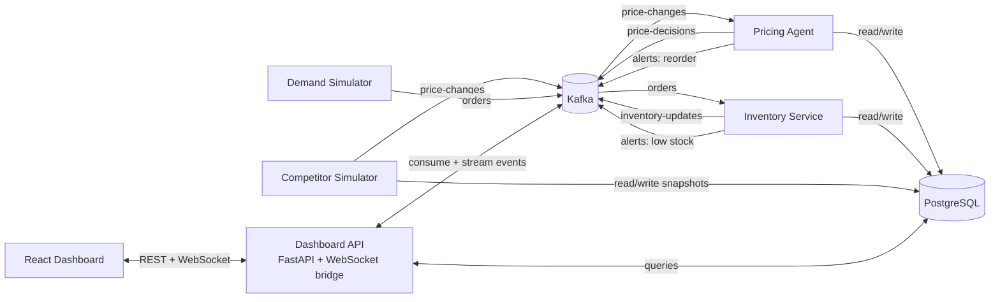

# SmartPriceAgent
### Real-time AI pricing intelligence for competitive e-commerce operations

---

## 1. Screenshots

> Add your screenshot assets here

- `docs/dashboard.png`
- `docs/products.png`
- `docs/decisions.png`

```md


```

---

## 2. Problem Statement

In fast-moving marketplaces, prices, demand, and stock levels change continuously. Manual pricing cannot react quickly enough without sacrificing margin or competitiveness.  
SmartPriceAgent solves this with an event-driven architecture where simulators generate market signals, an AI pricing agent makes guarded decisions, and a real-time dashboard surfaces execution outcomes.

---

## 3. Architecture Diagram



**Kafka topics**
- `price-changes`
- `orders`
- `inventory-updates`
- `price-decisions`
- `alerts`

---

## 4. Tech Stack


---

## 5. Key Features

- Event-driven microservices architecture with Kafka.
- Autonomous AI pricing agent with tool-use workflow (ReAct-style reasoning + guardrails).
- Real-time operations dashboard using WebSocket live feeds.
- Fast-path and slow-path decision architecture.
- Simulated marketplace for testing pricing, demand, and inventory scenarios.

---

## 6. Quick Start

### Prerequisites

- Docker Desktop
- Node.js 18+ (for local frontend development)
- OpenAI API key (optional but recommended for LLM-backed decisions)

### Clone and setup

```bash
git clone https://github.com/<your-username>/<your-repo>.git
cd <your-repo>
```

Create/update root `.env`:

```env
OPENAI_API_KEY=your_openai_api_key
OPENAI_MODEL=gpt-4o
```

Or bootstrap from template:

```bash
cp .env.example .env
```

Start backend/services:

```bash
docker compose up --build
```

Start backend/services in demo speed profile:

```bash
docker compose --profile demo up --build
```

Start frontend (separate terminal):

```bash
cd frontend
npm install
npm run dev
```

Open dashboard:

- `http://localhost:3000` (if mapped that way in your setup), or
- `http://localhost:5173` (Vite default in this repo)

---

## 7. Project Structure

```text
PriceWise/
|-- docker-compose.yml
|-- docker-compose.test.yml
|-- scripts/
|   |-- create-kafka-topics.sh
|   |-- setup-pricing-agent-test-scenarios.sql
|   `-- run-pricing-agent-test-scenarios.ps1
|-- frontend/
|   |-- src/
|   |   |-- components/
|   |   |-- context/
|   |   |-- pages/
|   |   `-- services/
|   `-- package.json
`-- services/
    |-- dashboard-api/
    |   |-- app/
    |   `-- tests/
    |-- competitor-simulator/
    |-- demand-simulator/
    |-- inventory-service/
    |-- pricing-agent/
    |   |-- app/
    |   `-- tests/
    `-- shared/
```

---

## 8. How the AI Agent Works

The pricing agent consumes `price-changes` events and executes a guarded decision pipeline:

1. Parse event and fetch context (product, competitors, inventory, demand trend).
2. Apply rule-engine filters:
   - ignore tiny competitor moves (`< 2%` by default),
   - ignore inactive products,
   - ignore own-price echo/noise.
3. Run fast-path guardrails for safe deterministic actions.
4. If context is ambiguous, run slow-path LLM reasoning with tool calls.
5. Validate output with hard constraints:
   - minimum margin floor,
   - max per-action price move,
   - competitor safety buffer,
   - cooldown windows.
6. Persist decision and publish:
   - `price-decisions` topic for execution visibility,
   - `alerts` topic for operational actions (for example reorder).

### Example decision flow

```text
Event: Competitor drops price by -4.2% for Product #48
-> Rule engine marks as significant
-> Agent checks margin headroom and demand trend
-> Suggested action: PRICE_DROP (-2.0%)
-> Guardrails validate minimum margin is still satisfied
-> Decision persisted + published to price-decisions
-> Dashboard updates in real time via WebSocket
```

---

## 9. API Documentation

- Swagger UI: `http://localhost:8000/docs`
- Health check: `http://localhost:8000/health`
- Kafka UI: `http://localhost:8080`

---

## 10. Configuration

| Variable | Service | Default | Description |
|---|---|---|---|
| `DATABASE_URL` | all backend services | varies | PostgreSQL connection string |
| `KAFKA_BOOTSTRAP_SERVERS` | all event services | `kafka:9092` | Kafka broker address |
| `OPENAI_API_KEY` | pricing-agent | none | Enables LLM-backed slow-path decisions |
| `OPENAI_MODEL` | pricing-agent | `gpt-4o` | Model for tool-calling decisions |
| `MIN_SIGNIFICANT_PRICE_CHANGE_PERCENT` | pricing-agent | `2.0` | Ignore micro competitor price changes |
| `PRICING_COOLDOWN_MINUTES` | pricing-agent | `10` | Per-product cooldown between actions |
| `LOW_STOCK_THRESHOLD` | pricing-agent, inventory-service | `15` | Threshold for low stock and reorder context |
| `SIMULATION_MIN_INTERVAL_SECONDS` | competitor-simulator, demand-simulator | `30` | Minimum event interval |
| `SIMULATION_MAX_INTERVAL_SECONDS` | competitor-simulator, demand-simulator | `60` | Maximum event interval |
| `SIMULATION_SPEED` | competitor-simulator, demand-simulator | `1.0` | Time acceleration factor |
| `DEMO_SIMULATION_MIN_INTERVAL_SECONDS` | competitor-simulator | `5` | Demo-profile minimum interval |
| `DEMO_SIMULATION_MAX_INTERVAL_SECONDS` | competitor-simulator | `20` | Demo-profile maximum interval |
| `DEMO_SIMULATION_SPEED` | competitor-simulator | `2.0` | Demo-profile speed multiplier |
| `DEMO_DEMAND_SIMULATION_MIN_INTERVAL_SECONDS` | demand-simulator | `5` | Demo-profile minimum interval |
| `DEMO_DEMAND_SIMULATION_MAX_INTERVAL_SECONDS` | demand-simulator | `20` | Demo-profile maximum interval |
| `DEMO_DEMAND_SIMULATION_SPEED` | demand-simulator | `2.0` | Demo-profile speed multiplier |
| `INVENTORY_CONSUMER_GROUP` | inventory-service | `inventory-service` | Kafka consumer group for inventory updates |
| `LOG_LEVEL` | all Python services | `INFO` | Structured JSON log level |
| `ALLOWED_ORIGINS` | dashboard-api | `["http://localhost:3000","http://localhost:5173"]` | CORS allowlist |

---

## 11. Running Tests

Install test dependencies:

```bash
pip install -r requirements-test.txt
```

Run dashboard API tests:

```bash
pytest services/dashboard-api/tests -q
```

Run pricing agent tests:

```bash
pytest services/pricing-agent/tests -q
```

Run all tests:

```bash
pytest -q
```

---

## 12. Future Improvements

- Kubernetes deployment with autoscaling and production observability.
- Real marketplace API integration.
- ML-based demand forecasting.
- Multi-agent collaboration.

---

## 13. Learnings

- Designing a reliable event-driven system requires strict contracts and idempotent consumers.
- Guardrails are essential when combining deterministic logic with LLM reasoning.
- Real-time dashboards are most useful when decision provenance is transparent.
- Simulators are powerful for validating microservice behavior before production integrations.
- Testing rule engines and fallback behavior is critical for trust in autonomous decisions.

---

## 14. Resume-Ready Highlights

- Built an event-driven microservice platform with Kafka, FastAPI, PostgreSQL, and React.
- Implemented a hybrid AI decision engine (rule engine + LLM tool-use + safety guardrails).
- Delivered real-time pricing observability with WebSocket streaming and decision drill-downs.
- Added unit/integration tests for core pricing, agent, and API flows.
